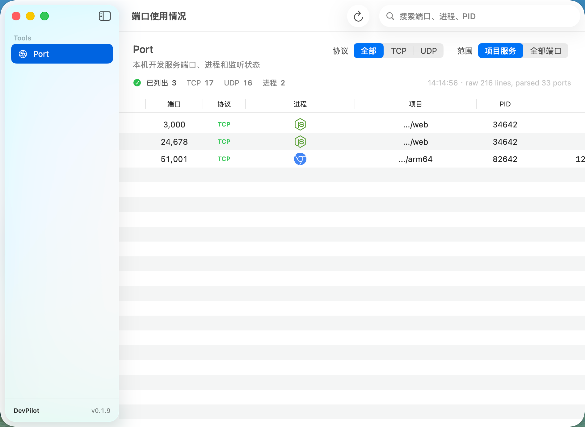
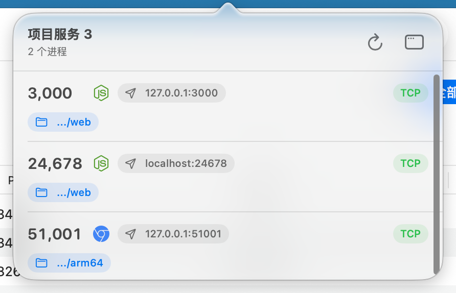

# DevPilot

[](https://developer.apple.com/macos/)
[](https://developer.apple.com/xcode/)
[](https://swift.org)

macOS 菜单栏端口监控工具。AI 编码 agent 跑完任务经常留下一堆没关的服务端口，得回命令行 `lsof` + `kill` 手动清理。DevPilot 把这些端口直接挂在菜单栏 —— 哪个进程、什么协议、跑在哪个项目目录一目了然，点一下就能关。





## 功能

- **菜单栏速览** — 点击菜单栏图标弹出端口卡片列表
- **范围筛选** — 切换「项目服务」仅看开发相关端口，或「全部端口」查看所有 TCP/UDP 监听
- **协议筛选** — TCP / UDP 分段切换
- **进程溯源** — `go run main.go` 编译出的 `main` 二进制自动关联到父进程 `go`
- **项目路径** — 显示服务的工作目录，hover 查看完整路径，右键可拷贝路径或在 Finder 中打开
- **一键终止** — 右键端口 → 关闭服务，自动去重 PID 后 `/bin/kill -TERM`
- **搜索过滤** — 支持端口号、进程名、父进程、PID、用户、地址、项目路径
- **自动刷新** — 每 3 秒自动扫描（可在设置中关闭），带 2.5 秒最小间隔防抖
- **手动刷新** — 工具栏按钮或 `Cmd + R` 快捷键

## 安装

### 直接下载

前往 [Releases](https://github.com/pkc918/DevPilot/releases) 下载最新 `DevPilot.dmg`，拖入 Applications 即可。首次打开需右键 → 打开。

### 从源码构建

```bash
git clone git@github.com:pkc918/DevPilot.git
cd DevPilot
xcodebuild -project DevPilot.xcodeproj -scheme DevPilot -configuration Release
```

或用 Xcode 打开 `DevPilot.xcodeproj`，选择 Debug scheme 运行。

要求 macOS 15+，Xcode 16+。

## 项目结构

```
DevPilot/
├── DevPilotApp.swift          # 入口：NSStatusBar 菜单栏 + 主窗口 + 设置
├── ContentView.swift          # 主界面：侧边栏 + 端口表格 + 筛选栏
├── SettingsView.swift         # 设置面板（自动刷新开关 + 更新检查）
├── UpdateController.swift     # Sparkle 2 自动更新控制器
├── AppVersionInfo.swift       # 版本号工具
├── Models/
│   └── PortUsage.swift        # 端口数据模型 + isProjectService 分类逻辑
├── Services/
│   └── PortScanner.swift      # lsof 扫描 + libproc 进程信息 + kill
└── Stores/
    └── PortMonitorStore.swift # 状态管理 + 双缓冲 + 范围感知刷新
```

## 分类逻辑

端口被归入「项目服务」需同时满足：

1. TCP 协议且 LISTEN 状态
2. 监听本地地址（`localhost` / `0.0.0.0` / `*` / `::` / `::1` / `127.*`）
3. 属于当前用户
4. 二进制不在以下路径前缀中：
   - `/Applications/` / `~/Applications/`
   - `/usr/sbin/` / `/usr/libexec/` / `/sbin/`
   - `/System/Library/` / `/Library/Apple/`

UDP 端口同样会被扫描，显示在「全部端口」范围中。

## 技术栈

- SwiftUI + AppKit（`NSStatusBar` / `NSPopover` 菜单栏）
- `lsof` 端口扫描 + CWD 解析
- `libproc`（`proc_pidpath` / `proc_pidinfo`）进程信息
- `NSWorkspace` Finder 集成 + `NSPasteboard` 路径拷贝
- [Sparkle 2](https://sparkle-project.org) 自动更新
- GitHub Actions 自动构建 + appcast 生成

## 友情链接

- [LINUX DO](https://linux.do/)
